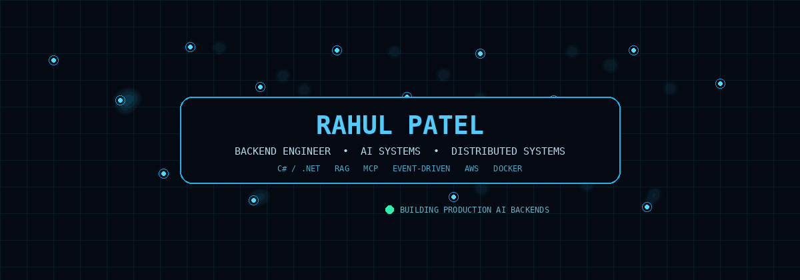
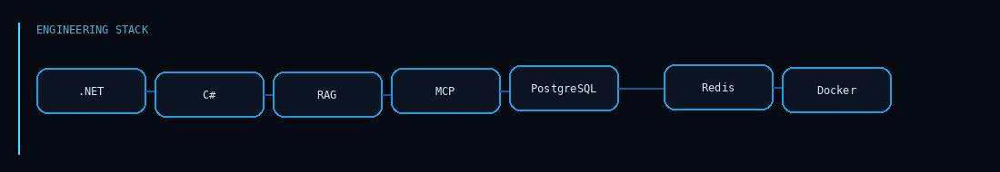
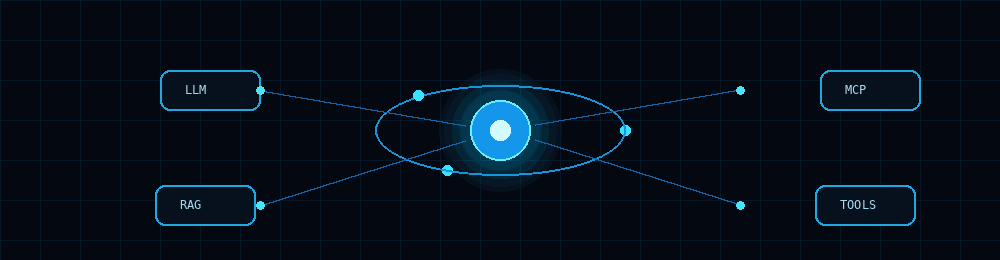
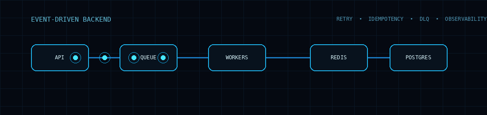

<div align="center">



<br><br>

<a href="https://www.linkedin.com/"></a>
<a href="mailto:YOUR_EMAIL"></a>
<a href="https://github.com/YOUR_GITHUB_USERNAME"></a>

</div>

---

# `// SYSTEMS I BUILD`

I build backend systems with a focus on **reliability, distributed execution and AI-powered workflows**.

My foundation is **C# / .NET**, backed by production experience with APIs, databases, event-driven processing and AWS services.

My current engineering direction:

**.NET Backend → Distributed Systems → AI Systems → Production AI Backends**

<div align="center">

</div>

---

## `// CURRENT ENGINEERING FOCUS`

<div align="center">

| 🧠 AI ENGINEERING | ⚙️ BACKEND | 🌐 DISTRIBUTED | ☁️ PRODUCTION |
|---|---|---|---|
| LLMs | C# / .NET | Event-driven | Docker |
| RAG | ASP.NET Core | RabbitMQ | CI/CD |
| Embeddings | REST APIs | SQS | AWS |
| Vector Search | EF Core | Redis | Observability |
| MCP | Async / Concurrency | Idempotency | Load Testing |
| Tool Calling | Worker Services | Retry / DLQ | Performance |
| Agents | System Design | Delivery Guarantees | Reliability |

</div>

---

## `// AI + AGENTIC ENGINEERING`

<div align="center">



</div>

### What I'm building toward

`LLMs` · `AI-assisted development` · `reasoning workflows` · `RAG` · `embeddings` · `vector search` · `MCP` · `tool calling` · `agents` · `structured output` · `guardrails` · `evaluation`

The goal isn't to collect AI libraries.

The goal is to understand the engineering underneath them:

**state → execution → context → tools → failure → evaluation → observability**

---

## `// DISTRIBUTED SYSTEMS`

<div align="center">



</div>

I care about the part of backend engineering that happens after the happy path:

```text
Worker dies
    ↓
Message is retried
    ↓
Same message arrives twice
    ↓
Idempotency protects the operation
    ↓
Persistent failure → DLQ
    ↓
Metrics explain what happened
```

Core areas:

`Event-Driven Architecture` · `Message Queues` · `Workers` · `Idempotency` · `Retries` · `DLQ` · `Concurrency` · `Caching` · `Consistency` · `Failure Handling`

---

## `// RAG ENGINEERING`

```text
DOCUMENTS
    │
    ▼
INGESTION
    │
    ▼
CHUNKING
    │
    ▼
EMBEDDINGS
    │
    ▼
VECTOR STORE
    │
    ▼
RETRIEVAL
    │
    ▼
CONTEXT CONSTRUCTION
    │
    ▼
LLM
    │
    ▼
GROUNDED RESPONSE
    │
    └──► CITATIONS / EVALUATION
```

Focus:

`retrieval quality` · `chunking strategy` · `embedding quality` · `vector search` · `context limits` · `citations` · `evaluation` · `latency` · `token efficiency`

---

## `// MCP + TOOL-USING AI`

```text
                 ┌───────────────┐
                 │      LLM      │
                 └───────┬───────┘
                         │
                  PLAN / REASON
                         │
                         ▼
                 ┌───────────────┐
                 │  ORCHESTRATOR │
                 └───────┬───────┘
                         │
          ┌──────────────┼──────────────┐
          ▼              ▼              ▼
       MCP TOOL        RAG          BACKEND API
          │              │              │
          └──────────────┼──────────────┘
                         ▼
                  VALIDATED RESULT
```

Areas:

`Tool Discovery` · `Tool Invocation` · `Context` · `Permissions` · `Failure Handling` · `Orchestration`

---

## `// FEATURED SYSTEMS`

### ⚙️ Distributed Job Processing Platform

**Status:** `BUILDING`

A production-style distributed backend focused on:

- .NET API
- Worker services
- Queue-based execution
- PostgreSQL
- Redis
- RabbitMQ
- Idempotent processing
- Retry / DLQ
- Failure recovery
- Docker
- CI/CD
- Observability
- Load testing
- p95 / p99 measurement

> The distributed behaviour is the project — not decoration around CRUD.

---

### 🧠 AI + RAG Backend

**Status:** `BUILDING`

A backend for grounded AI responses using retrieval, vector search and citations.

Focus:

`Ingestion → Retrieval → Context → Generation → Citations → Evaluation`

---

### 🔌 MCP + Tool-Using Backend

**Status:** `BUILDING`

Exploring how LLMs interact with external tools and backend capabilities through controlled tool execution.

Focus:

`Discovery → Selection → Invocation → Validation → Failure Recovery`

---

## `// PROFESSIONAL FOUNDATION`

**4.5+ years of backend engineering**

Production experience across:

`C#` · `.NET` · `ASP.NET Core` · `REST APIs` · `SQL Server` · `PostgreSQL` · `Redis` · `RabbitMQ` · `AWS` · `SQS` · `EventBridge`

I have worked on enterprise backend systems, SaaS platforms, event-driven processing, real-time systems, integrations and performance-sensitive database workloads.

One production example: an email-processing pipeline was redesigned into an event-driven AWS architecture with concurrent consumers, reducing a full processing run from roughly **7–10 hours to 1–1.5 hours**.

---

## `// ENGINEERING STACK`

<div align="center">


<br><br>


</div>

---

## `// GITHUB ACTIVITY`

<div align="center">


<br><br>


</div>

---

## `// ENGINEERING PRINCIPLES`

> **Build systems, not demos.**

> **Understand the mechanism, not only the API.**

> **Measure before optimizing.**

> **Design for failure.**

> **Make distributed behaviour explicit.**

> **Know the trade-off behind every technology choice.**

---

<div align="center">

### `BUILD → MEASURE → BREAK → UNDERSTAND → IMPROVE`

**Backend Systems · Distributed Systems · AI Systems**

</div>
