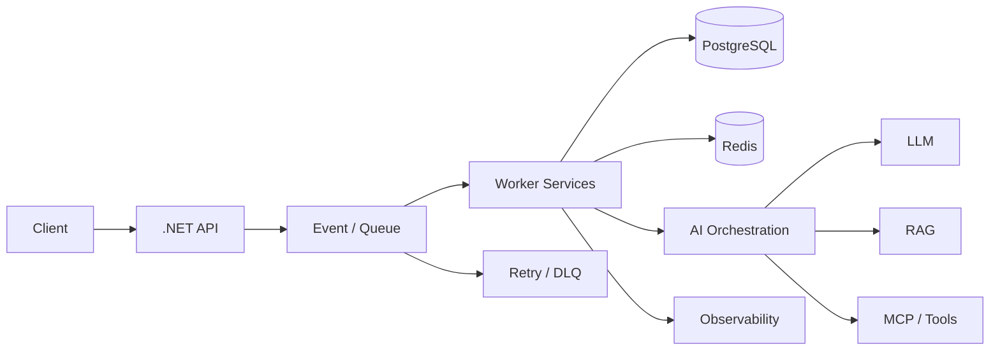

<div align="center">

# Rahul Patel

### Backend Engineer · AI Systems · Distributed Systems

**C# / .NET · AI Engineering · RAG · MCP · Event-Driven Architecture**

<br/>

[](https://github.com/DenverCoder1/readme-typing-svg)

</div>

---

## ⚡ Engineering Profile

```text
Backend Engineering
        │
        ├── C# / .NET / ASP.NET Core
        ├── REST APIs / EF Core
        ├── Async / Concurrency / Background Services
        │
        ▼
Distributed Systems
        │
        ├── Event-Driven Architecture
        ├── Queues / Workers
        ├── Idempotency / Retry / DLQ
        ├── Redis / RabbitMQ / AWS Messaging
        │
        ▼
AI Systems
        │
        ├── LLM Applications
        ├── AI-assisted Engineering
        ├── RAG / Embeddings / Vector Search
        ├── MCP / Tool Calling / Agents
        │
        ▼
Production Engineering
        │
        ├── PostgreSQL / SQL Server / NoSQL
        ├── Docker / CI-CD
        ├── AWS / Observability
        ├── Load Testing / Performance
        └── System Design / HLD / LLD
```

## 🧠 Engineering Focus

<table>
<tr>
<td width="50%" valign="top">

### Backend
- C#
- .NET / ASP.NET Core
- ASP.NET MVC / Web API
- Entity Framework Core
- REST API design
- Async / Await
- Concurrency & Multithreading
- Background Services
- Dependency Injection
- Middleware

</td>
<td width="50%" valign="top">

### AI Engineering
- LLM applications
- AI-assisted development
- AI reasoning workflows
- Prompt engineering
- RAG
- Embeddings
- Vector search
- MCP
- Tool calling
- AI agents

</td>
</tr>

<tr>
<td width="50%" valign="top">

### Distributed Systems
- Event-driven architecture
- Message queues
- RabbitMQ
- AWS SQS
- AWS EventBridge
- Redis
- Idempotency
- Retry strategies
- Dead-letter queues
- At-least-once delivery

</td>
<td width="50%" valign="top">

### Data & Infrastructure
- PostgreSQL
- SQL Server
- NoSQL
- Vector databases
- Query optimization
- Indexing
- Transactions
- Docker
- CI/CD
- AWS

</td>
</tr>
</table>

---

## 🏗️ What I Build



### Engineering priorities

**Correctness → Reliability → Scalability → Observability → Performance**

I focus on systems that can be explained from the request path down to the database, queue, worker, failure mode and trade-off.

---

## 🚀 Featured Engineering Work

### Distributed Job Processing Platform

A production-style distributed backend focused on:

- .NET Web API
- Worker services
- Message-driven processing
- PostgreSQL
- Redis
- RabbitMQ / queue-based architecture
- Idempotent job execution
- Retry & dead-letter handling
- Failure recovery
- Docker
- CI/CD
- Observability
- Load testing
- p95 / p99 performance measurement

**Architecture**

```text
                 ┌──────────────┐
                 │   .NET API   │
                 └──────┬───────┘
                        │
                        ▼
                 ┌──────────────┐
                 │ Message Bus  │
                 └──────┬───────┘
                        │
              ┌─────────┴─────────┐
              ▼                   ▼
       ┌─────────────┐     ┌─────────────┐
       │   Worker 1  │     │   Worker 2  │
       └──────┬──────┘     └──────┬──────┘
              │                   │
              └─────────┬─────────┘
                        ▼
                 ┌──────────────┐
                 │  PostgreSQL  │
                 └──────────────┘
                        │
                        ▼
                 ┌──────────────┐
                 │    Redis     │
                 └──────────────┘

        Retry ──► DLQ
        Metrics ─► Observability
```

---

### AI + RAG Backend

AI backend architecture focused on:

```text
Documents
    │
    ▼
Ingestion
    │
    ▼
Chunking
    │
    ▼
Embeddings
    │
    ▼
Vector Store
    │
    ▼
Retriever
    │
    ▼
LLM
    │
    ▼
Grounded Response + Citations
```

Key engineering areas:

- Retrieval quality
- Chunking strategy
- Embeddings
- Vector search
- Context construction
- Citation generation
- Evaluation
- Latency
- Cost / token efficiency
- Failure handling

---

### MCP + Tool-Using AI

```text
                  ┌─────────────┐
                  │     LLM     │
                  └──────┬──────┘
                         │
                  Tool selection
                         │
                         ▼
                  ┌─────────────┐
                  │ MCP Client  │
                  └──────┬──────┘
                         │
             ┌───────────┼───────────┐
             ▼           ▼           ▼
          Database      API       Files/Tools
```

Focus:

- MCP concepts
- Tool discovery
- Tool invocation
- Context handling
- Permissions
- Failure handling
- AI backend orchestration

---

## ☁️ Production Stack

<p align="center">


</p>

### Core

`C#` · `.NET` · `ASP.NET Core` · `EF Core` · `REST`

### Data

`PostgreSQL` · `SQL Server` · `Redis` · `NoSQL` · `Vector Search`

### Distributed

`RabbitMQ` · `AWS SQS` · `AWS EventBridge` · `Event-Driven Systems`

### AI

`LLMs` · `RAG` · `Embeddings` · `Vector Search` · `MCP` · `Agents`

### Delivery

`Docker` · `CI/CD` · `GitHub Actions` · `AWS` · `Observability`

---

## 📊 GitHub Activity

<div align="center">


<br/>


</div>

---

## 🐍 Contribution Activity

<div align="center">


</div>

---

## 📈 Engineering Direction

```text
.NET Backend
     │
     ├── Runtime & Internals
     ├── Concurrency
     ├── Database Internals
     └── API Engineering
             │
             ▼
     Distributed Systems
             │
             ├── Messaging
             ├── Caching
             ├── Reliability
             └── System Design
                     │
                     ▼
                 AI Systems
                     │
                     ├── LLMs
                     ├── RAG
                     ├── MCP
                     ├── Agents
                     └── AI Workflows
                             │
                             ▼
                     Production AI Backend
```

---

## 🧩 Engineering Principles

```text
Build systems, not demos.

Understand the mechanism, not only the API.

Measure before optimizing.

Design for failure.

Make distributed behaviour explicit.

Prefer simple architecture until scale requires complexity.

Know the trade-off behind every technology choice.
```

---

## 💼 Professional Experience

**Backend Engineer — 4.5+ years**

Production experience across:

- Enterprise .NET applications
- Large-scale SaaS
- eDiscovery / LegalTech
- REST APIs
- Event-driven processing
- AWS messaging
- SQL Server & PostgreSQL
- Query and index optimization
- Real-time communication
- Payment integrations
- Third-party APIs

One example from production: an email-processing pipeline was redesigned from sequential processing into an event-driven AWS pipeline with concurrent consumers, reducing a full processing run from roughly **7–10 hours to 1–1.5 hours**.

---

## 📫 Connect

<div align="center">

[](https://linkedin.com/in/rahul-patel-889459229)

[](mailto:rahulpatel.bca10@gmail.com)

</div>

---

<div align="center">

### Building backend systems that can scale, recover, and reason.

</div>
