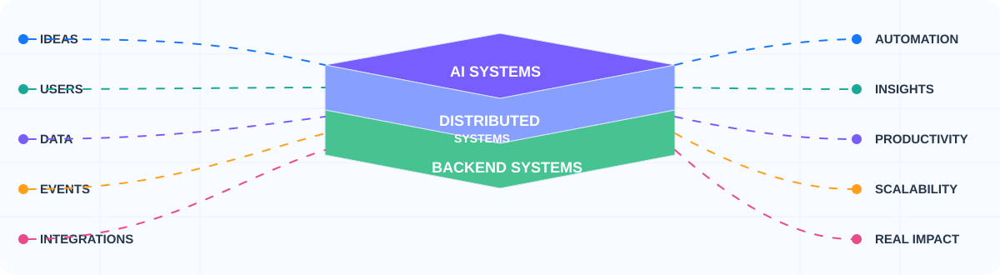
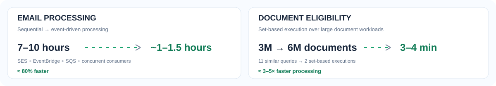

<div align="center">

# RAHUL PATEL

### Backend Engineer

**C# / .NET · AWS · MSSQL · Distributed Systems · AI**

Building production backend systems and AI-native software systems that solve real business problems at scale.

[LinkedIn](https://www.linkedin.com/in/rahul-patel-889459229/) · [Email](mailto:rahulpatel.dev.in@gmail.com)

</div>

<p align="center">
  
</p>

---

## WHAT I HAVE SHIPPED

Real production problems turned into measurable improvements.

| Production work | Result |
|---|---|
| **Email processing pipeline** | **7–10 hours → ~1–1.5 hours** · ~80% faster |
| **Document eligibility processing** | **3M → 6M documents** · **15–20 min → 3–4 min** |
| **Query optimization** | **11 similar queries → 2 set-based executions** |

Production work includes high-volume ingestion, multi-tenant SaaS, APIs, background processing, SQL optimization, queue-based processing, event-driven systems and third-party integrations.

<p align="center">
  
</p>

---

## SYSTEMS I WORK WITH

- **Multi-tenant SaaS**
- **High-volume ingestion**
- **Multi-million document/data workloads**
- **Event-driven processing**
- **Queue and background workers**
- **Real-time communication**
- **Third-party integrations**
- **Secure and reliable backend systems**

---

## TECHNICAL SKILLS

### Backend & Frameworks
`C#` ` .NET Core` `ASP.NET Core` `ASP.NET MVC` `ASP.NET Web API` `EF Core` `LINQ` `Dependency Injection` `Middleware` `Async/Await` `Concurrency` `Multithreading` `Background Services`

### Data & Storage
`MSSQL` `PostgreSQL` `T-SQL` `Stored Procedures` `Query Optimization` `Indexing` `Execution Plans` `Redis` `Caching`

### Cloud & Messaging
`AWS` `SES` `EventBridge` `SQS` `RabbitMQ` `Event-Driven Architecture` `Queue-Based Processing` `Concurrent Consumers`

### API, Security & Integrations
`REST APIs` `Swagger` `JWT` `OAuth 2.0` `Role-Based Access` `SignalR` `WebSockets` `FCM` `Stripe` `PayPal` `CCAvenue` `Vonage` `Google Maps` `Third-Party APIs`

### Engineering
`SOLID` `Design Patterns` `Unit Testing` `xUnit` `Code Review` `Debugging` `Performance Optimization` `Agile/Scrum` `SDLC`

---

## TOOLCHAIN

`VS Code` · `Visual Studio` · `Git` · `GitHub` · `Docker` · `Postman` · `SQL Server / SSMS` · `pgAdmin` · `AWS` · `Azure DevOps / TFS`

---

## ENGINEERING DEPTH

### C# / .NET
OOP · SOLID · Generics & Collections · LINQ · Async/Concurrency · Memory & Runtime · Design Patterns · Middleware · Dependency Injection

### DSA & Problem Solving
Data Structures · Algorithms · Big-O · Arrays · Strings · Hashing · Trees · Graphs · Recursion · Dynamic Programming · Pattern Recognition

### System Design & Architecture
Distributed Systems · Scalability · Reliability · Caching · Messaging · Rate Limiting · Idempotency · Retries · Circuit Breakers · High Availability · Microservices · Event-Driven Architecture · Observability · Design Trade-offs

### Engineering Practice
Debugging · Performance Analysis · Unit Testing · Code Review · Security · Production Troubleshooting · Technical Trade-offs · Technical Communication

---

## AI ENGINEERING

AI is the direction I am building toward from a backend engineering foundation.

**LLM fundamentals**  
Model interaction · tokens · context windows · prompt engineering · model parameters · local models · model selection

**LLM application engineering**  
LLM API integration · structured output · tool/function calling · streaming · model routing

**RAG & retrieval**  
Embeddings · chunking · vector search · semantic search · hybrid search · reranking · pgvector · grounded generation

**Agentic systems**  
MCP · tool use · memory · planning · multi-agent workflows · guardrails · prompt-injection awareness · AI monitoring

**Platforms / local AI**  
Azure OpenAI · Ollama · LM Studio

---

## PROJECT ZERO

<p align="center">
  
</p>

**Project Zero** is a personal SaaS-level project focused on helping organizations integrate AI with their existing systems and automate daily work through intelligent workflows.

> Public profile view: high-level only. Internal strategy, architecture decisions and private product details are intentionally not included here.

---

## AI × BACKEND

```text
BACKEND ENGINEERING
APIs · Data · Queues · Caching · Distributed Systems · Security
                         │
                         ▼
                  AI BACKEND SYSTEMS
          LLMs · Retrieval · RAG · Tools · MCP
                         │
                         ▼
                    PROJECT ZERO
```

---

## ENGINEERING COMMUNICATION

I focus on being able to explain:

**The problem → the trade-off → the failure → the decision → the result**

DSA reasoning · system design discussions · production incident analysis · technical trade-offs · code review · clear collaboration

---

<div align="center">

### Backend systems first. AI systems next.

[LinkedIn](https://www.linkedin.com/in/rahul-patel-889459229/) · [rahulpatel.dev.in@gmail.com](mailto:rahulpatel.dev.in@gmail.com)

</div>
