<div align="center">


<br><br>

<a href="https://github.com/YOUR_GITHUB_USERNAME"></a>
<a href="https://www.linkedin.com/in/YOUR_LINKEDIN"></a>
<a href="mailto:YOUR_EMAIL"></a>

</div>

---

## `// SYSTEMS I BUILD`

**Backend Engineer focused on production systems, distributed execution and AI engineering.**

My foundation is **C# / .NET**. My current direction is:

**.NET Backend → Distributed Systems → AI Systems → Production AI Backends**

I care about what happens underneath the abstraction:

`state` · `execution` · `context` · `failure` · `data` · `scale` · `observability` · `trade-offs`

---

## `// ENGINEERING SIGNAL`

<div align="center">

| 🧠 AI SYSTEMS | ⚙️ BACKEND | 🌐 DISTRIBUTED | ☁️ PRODUCTION |
|:---:|:---:|:---:|:---:|
| LLMs | C# / .NET | Event-driven | Docker |
| RAG | ASP.NET Core | RabbitMQ | CI/CD |
| MCP | REST / EF Core | SQS | AWS |
| Agents | Async / Workers | Redis | Observability |
| Embeddings | System Design | Retry / DLQ | Load Testing |

</div>

---

<div align="center">

</div>

## `// AI + AGENTIC ENGINEERING`

**LLMs · Reasoning Workflows · RAG · Embeddings · Vector Search · MCP · Tool Calling · Agents**

The target is not “knowing AI tools”.

It is building backends where an AI system can:

**retrieve → reason → call tools → validate → recover → produce grounded output**

---

<div align="center">

</div>

## `// DISTRIBUTED SYSTEMS`

I focus on the failure paths that separate a demo from a real backend:

- duplicate messages
- worker failure
- retries
- idempotency
- dead-letter queues
- backpressure
- concurrency
- consistency
- observability
- p95 / p99 performance

---

## `// RAG ENGINEERING`

```text
DOCUMENTS
   ↓
INGESTION
   ↓
CHUNKING
   ↓
EMBEDDINGS
   ↓
VECTOR STORE
   ↓
RETRIEVAL
   ↓
CONTEXT
   ↓
LLM
   ↓
GROUNDED RESPONSE
   ↓
CITATIONS + EVALUATION
```

Focus:

`retrieval quality` · `chunking` · `embeddings` · `vector search` · `context limits` · `citations` · `evaluation` · `latency` · `token efficiency`

---

<div align="center">

</div>

## `// SYSTEMS IN DEVELOPMENT`

### ⚡ Distributed Job Processing Platform

`C#` · `.NET` · `PostgreSQL` · `Redis` · `RabbitMQ` · `Workers` · `Docker` · `CI/CD`

**Idempotency · Retry · DLQ · Failure Recovery · Observability · Load Testing**

### 🧠 AI + RAG Backend

`LLM` · `Embeddings` · `Vector Search` · `Retrieval` · `Citations` · `Evaluation`

### 🔌 MCP + Tool-Using AI

`Tool Discovery` · `Tool Invocation` · `Context` · `Permissions` · `Orchestration`

---

## `// PROFESSIONAL FOUNDATION`

**4.5+ years of backend engineering**

Production experience with:

`C#` · `.NET` · `ASP.NET Core` · `REST APIs` · `SQL Server` · `PostgreSQL` · `Redis` · `RabbitMQ` · `AWS` · `SQS` · `EventBridge`

One production example: an email-processing pipeline was redesigned into an event-driven AWS architecture with concurrent consumers, reducing a full processing run from roughly **7–10 hours to 1–1.5 hours**.

---

## `// STACK`

<div align="center">


<br><br>


</div>

---

## `// GITHUB ACTIVITY`

<div align="center">


</div>

---

<div align="center">

### `BUILD → MEASURE → BREAK → UNDERSTAND → IMPROVE`

**Backend Systems · Distributed Systems · AI Systems**

</div>
