 

## What I have shipped

Production work across high-volume ingestion, multi-tenant SaaS, APIs, background processing, SQL optimization and event-driven systems.

 

## Systems I work with

| | |
|---|---|
| **Multi-tenant SaaS** | **Event-driven processing** |
| **High-volume ingestion** | **Background / queue workers** |
| **Multi-million document data** | **Real-time communication** |
| **Third-party integrations** | |

 

## Engineering depth

<table>
<tr>
<td valign="top" width="25%">

**C# / .NET** 
OOP · SOLID · Generics · LINQ · EF Core · Async / Await · Concurrency · Multithreading · Memory / Runtime · Dependency Injection · Middleware · Background Services

</td>
<td valign="top" width="25%">

**Problem solving** 
DSA · Algorithms · Big-O · Arrays · Strings · Hashing · Trees · Graphs · Sliding Window · Two Pointers · Recursion · Dynamic Programming

</td>
<td valign="top" width="25%">

**System design** 
Distributed Systems · Caching · Messaging · Queues · Rate Limiting · Idempotency · Retries · Circuit Breakers · High Availability · Scalability · Observability · Microservices · CQRS · Event-driven Architecture

</td>
<td valign="top" width="25%">

**Engineering practice** 
Debugging · Performance Optimization · Code Review · Unit Testing · xUnit · API Design · Security · Production Troubleshooting · Technical Trade-offs

</td>
</tr>
</table>

 

## Technical system

| | |
|---|---|
| **Backend** | C# · .NET Core · .NET Framework · ASP.NET Core · ASP.NET MVC · ASP.NET Web API · EF Core · LINQ |
| **Data** | SQL Server · PostgreSQL · T-SQL · Stored Procedures · Indexing · Execution Plans · Query Optimization · Redis · Caching |
| **Cloud / Messaging** | AWS · SES · EventBridge · SQS · RabbitMQ · Event-driven Systems · Queue-based Processing |
| **API / Security** | REST · Swagger · JWT · OAuth 2.0 · Role-based Access |
| **Integrations** | SignalR · WebSockets · FCM · Stripe · PayPal · CCAvenue · Vonage · Google Maps · Third-party APIs |

 

## Toolchain

| Build | Data | Delivery | Test / Debug |
|---|---|---|---|
| Visual Studio | SQL Server | Docker | Postman |
| VS Code | PostgreSQL | AWS | xUnit |
| Git | pgAdmin | Azure DevOps | |
| GitHub | SSMS | TFS | |
| | Redis | | |

 

## AI engineering

Knowledge areas I'm building toward AI backend systems with.

<table>
<tr>
<td valign="top" width="25%">

**LLM fundamentals** 
LLM API Integration · Input / Output · Tokens · Context Windows · Prompt / Response · Model Parameters · Model Selection · Local Models

</td>
<td valign="top" width="25%">

**AI applications** 
AI-assisted Development · LLM Integration · Structured Output · Tool Calling · Function Calling · Streaming · Model Routing

</td>
<td valign="top" width="25%">

**Retrieval** 
Embeddings · Chunking · Vector Search · Semantic Search · Hybrid Search · RAG · Re-ranking · pgvector

</td>
<td valign="top" width="25%">

**Agentic systems** 
MCP · Agentic AI · Memory · Planning · Tool Use · Multi-Agent Workflows · Guardrails · Prompt Injection · AI Monitoring

</td>
</tr>
</table>

 

## Project Zero

**AI-native software infrastructure for organizations.**

A SaaS-level platform focused on connecting AI with existing business systems and turning AI capabilities into useful organizational workflows.

 

## AI × Backend

 

## Engineering communication

Explain the problem. Explain the trade-off. Explain the failure. Explain the decision. Explain the result.

DSA reasoning · System design discussion · Production incident analysis · Technical trade-offs · STAR-based experience · Code review · Cross-functional communication

 

## Connect

**Rahul Patel** · Backend Engineer · AI Backend Systems

[LinkedIn](https://www.linkedin.com/in/rahul-patel-889459229) · [rahulpatel.dev.in@gmail.com](mailto:rahulpatel.dev.in@gmail.com)
