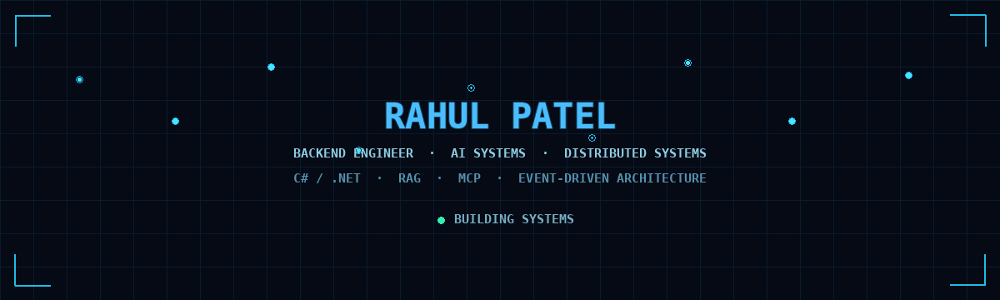
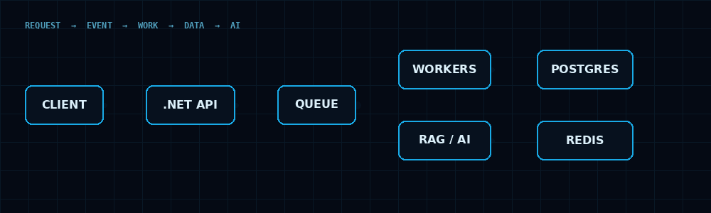
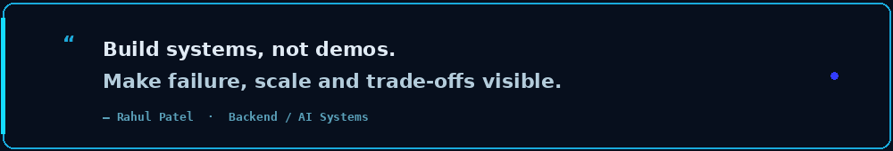

<div align="center">



<br>

<a href="https://www.linkedin.com/in/rahul-patel-889459229/"></a>
<a href="mailto:rahulpatel.dev.in@gmail.com"></a>
<a href="https://github.com/004-rahul"></a>

</div>

---

## `// SYSTEMS I BUILD`

I am a backend engineer focused on **production-grade backend and AI systems**.

My direction is not “learn a list of AI tools”. It is to understand what happens underneath them:

**state · execution · failure · data · scale · observability · trade-offs**

My core engineering foundation is **C# / .NET**, with production experience in APIs, databases, event-driven processing and AWS services. I am extending that foundation into **AI engineering, RAG, MCP, distributed systems and production AI backends**.

<div align="center">

</div>

---

## `// CURRENT ENGINEERING FOCUS`

| Area | Focus |
|---|---|
| **AI Engineering** | LLM applications · AI-assisted development · reasoning workflows · RAG · embeddings · vector search · MCP · tool calling · agents |
| **Backend** | C# · .NET · ASP.NET Core · REST APIs · EF Core · async/await · concurrency · worker services |
| **Distributed Systems** | Event-driven architecture · queues · RabbitMQ · SQS · retries · idempotency · DLQ · delivery guarantees |
| **Data** | PostgreSQL · SQL Server · Redis · NoSQL · indexing · transactions · query optimization |
| **Infrastructure** | Docker · CI/CD · AWS · observability · load testing |
| **Architecture** | HLD · LLD · SOLID · design patterns · scalability · reliability · failure handling |

---

## `// AI + AGENTIC ENGINEERING`

```text
                    ┌──────────────┐
                    │     LLM      │
                    └──────┬───────┘
                           │
                    reasoning / planning
                           │
                           ▼
                    ┌──────────────┐
                    │ Orchestrator │
                    └──────┬───────┘
                           │
              ┌────────────┼────────────┐
              ▼            ▼            ▼
            RAG           MCP        Tools
              │            │            │
              ▼            ▼            ▼
          Retrieval     Context      APIs / DB
              │
              ▼
       grounded response
       + citations
       + validation
```

### Areas I'm building toward

`LLMs` · `RAG` · `Embeddings` · `Vector Search` · `MCP` · `Tool Calling` · `Agent Workflows` · `Structured Output` · `Guardrails` · `Evaluation`

---

## `// DISTRIBUTED BACKEND`

The interesting part of a backend is not the happy path.

It is what happens when:

- a worker dies halfway through a job
- the same message arrives twice
- a dependency becomes slow
- the queue backs up
- a database fails over
- a retry creates duplicate work
- traffic grows by 10×
- the system needs to explain what happened

That is where I focus my system-design work.

---

## `// FEATURED PROJECTS`

### ⚙️ Distributed Job Processing Platform

**Status:** `BUILDING`

Production-style distributed backend designed around:

`C#` · `.NET` · `PostgreSQL` · `Redis` · `RabbitMQ` · `Worker Services` · `Docker` · `CI/CD`

Engineering goals:

- idempotent job execution
- retry policies
- dead-letter queues
- worker failure recovery
- concurrent processing
- observability
- load testing
- p95 / p99 measurements
- explicit consistency and delivery trade-offs

> The distributed behaviour is the project — not decoration around CRUD.

---

### 🧠 AI + RAG Backend

**Status:** `BUILDING`

```text
Documents
   ↓
Ingestion
   ↓
Chunking
   ↓
Embeddings
   ↓
Vector Store
   ↓
Retrieval
   ↓
Context Construction
   ↓
LLM
   ↓
Grounded Answer + Citations
```

Focus areas:

`retrieval quality` · `chunking` · `embeddings` · `vector search` · `citations` · `evaluation` · `latency` · `token efficiency`

---

### 🔌 MCP + Tool-Using AI

**Status:** `BUILDING`

Exploring the backend side of MCP and tool-using AI:

`tool discovery` · `tool invocation` · `context handling` · `permissions` · `failure handling` · `orchestration`

---

## `// PROFESSIONAL FOUNDATION`

**4.5+ years of backend engineering**

Production experience includes:

- C# / .NET backend systems
- ASP.NET / ASP.NET Core
- REST APIs
- SQL Server / PostgreSQL
- Redis
- RabbitMQ
- AWS SQS / EventBridge / SES
- event-driven processing
- performance optimization
- real-time systems
- third-party API integrations

One production example: redesigned an email-processing pipeline into an event-driven AWS architecture with concurrent consumers, reducing a full processing run from roughly **7–10 hours to 1–1.5 hours**.

---

## `// ENGINEERING PRINCIPLES`

<div align="center">

</div>

- **Understand the mechanism, not only the API.**
- **Measure before optimizing.**
- **Design for failure.**
- **Make distributed behaviour explicit.**
- **Know the trade-off behind every technology choice.**
- **Build systems that can be defended, not just demonstrated.**

---

## `// GITHUB ACTIVITY`

<div align="center">


<br><br>


</div>

---

<div align="center">

### Backend systems · AI systems · distributed systems

`BUILD → MEASURE → BREAK → UNDERSTAND → IMPROVE`

</div>
